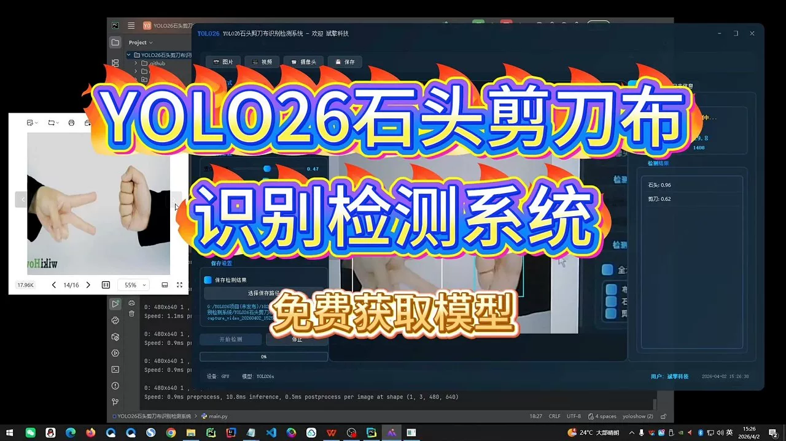
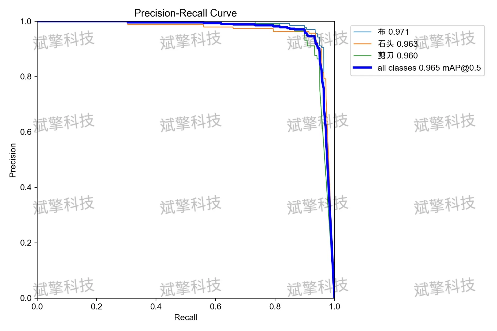
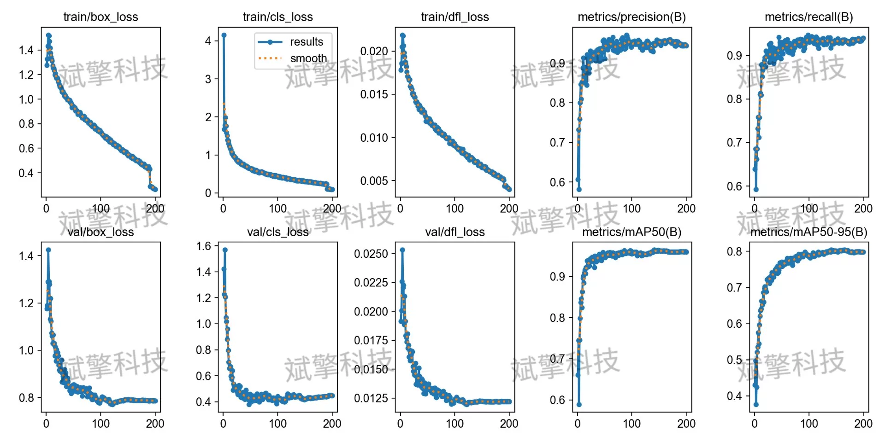
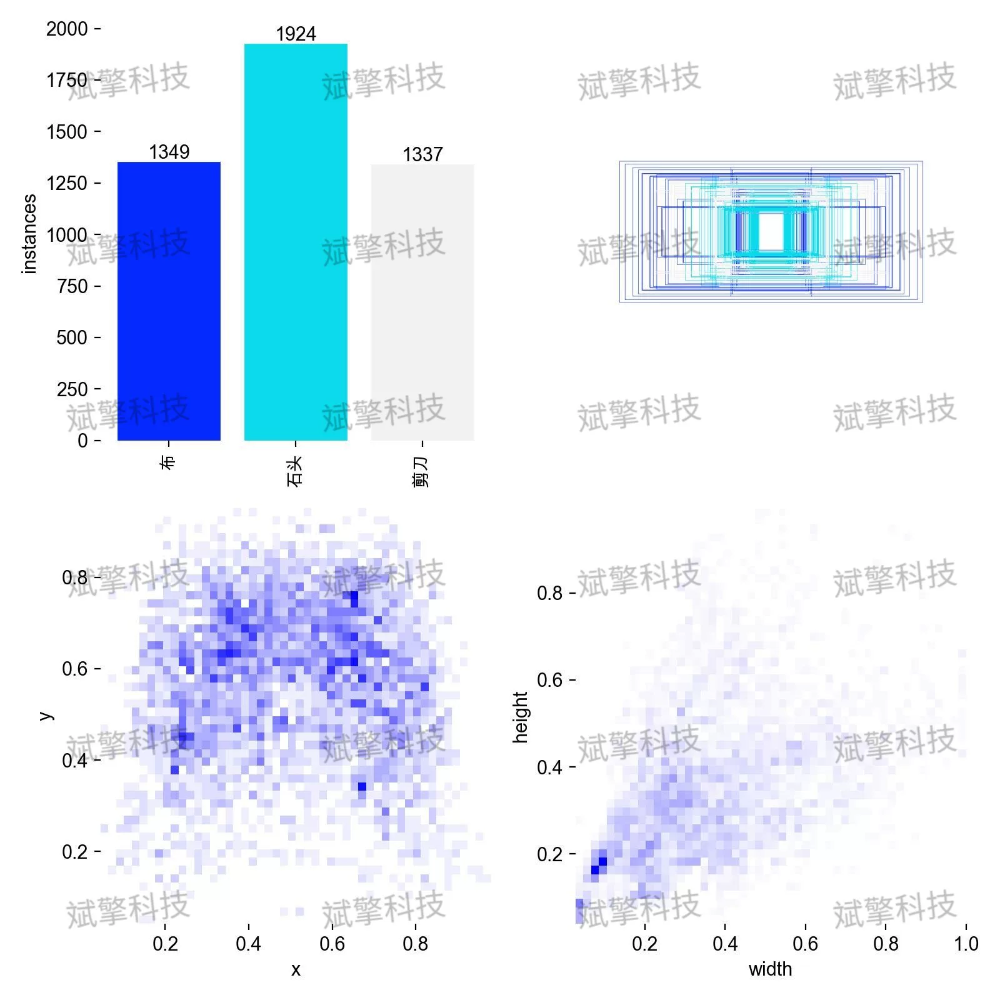
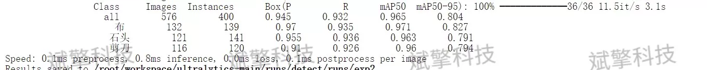
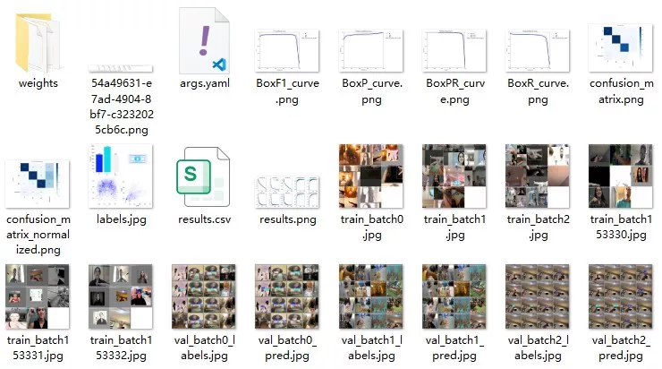
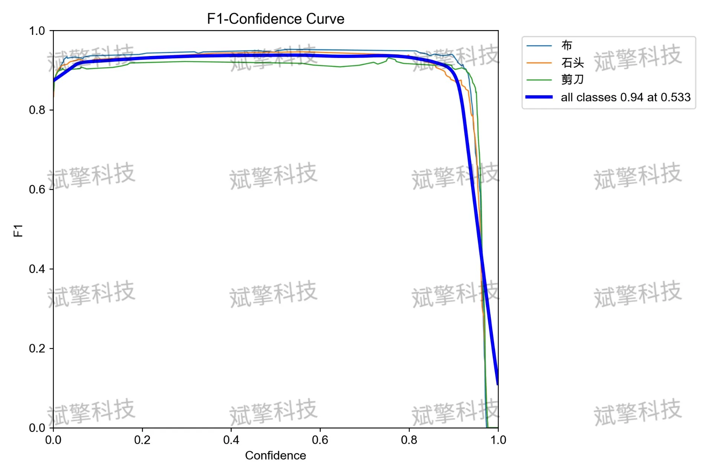
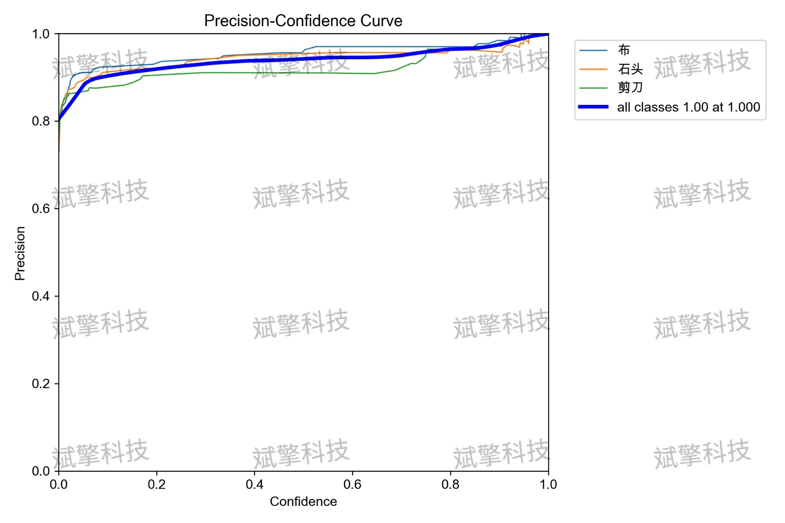
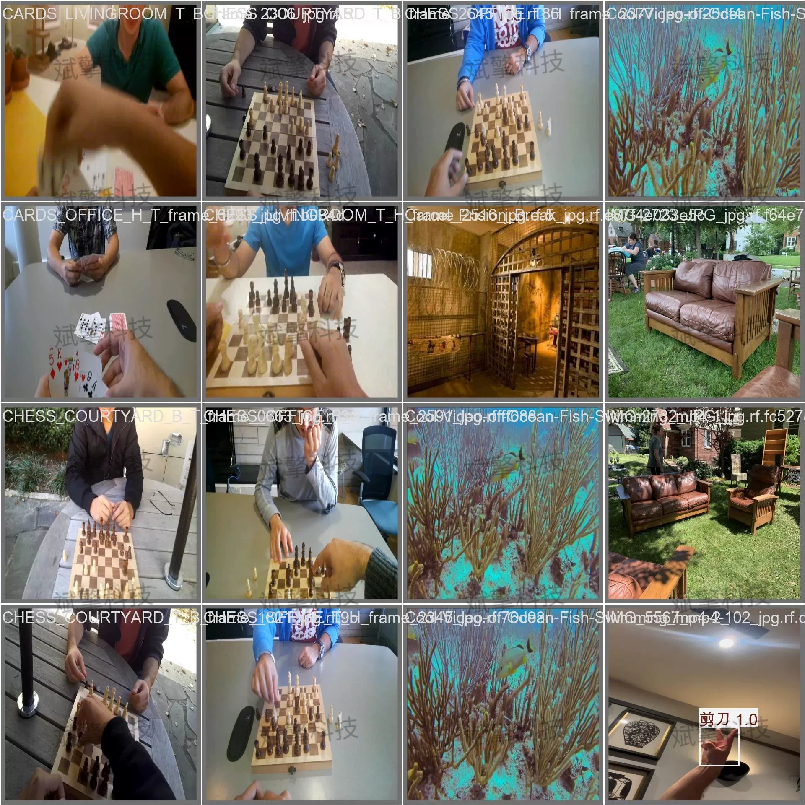

# YOLO26 Rock, Paper, Scissors Recognition Detection System | Source Code

## Body

YOLO26 Stone-Scissors Recognition Detection System | Source Code, Dataset, Model Weights, UI Interface, Python, Deep Learning, Remote Environment Deployment

This article is based on the YOLO26 object detection algorithm and has built a set of stone-scissors gesture recognition detection systems. The system targets "Paper", "Rock", and "Scissors" for real-time detection and classification. The experiment uses a dataset containing 7359 images (6455 training, 576 validation, 304 testing), after sufficient training, the model achieved excellent performance on the validation set: overall mAP50 reached 0.965, precision rate was 0.945, recall rate was 0.932. Among them, the recognition effect of "Paper" was the best (mAP50=0.971), and "Scissors" was slightly lower (mAP50=0.960). The confusion matrix analysis showed that the mutual misjudgment rate between the three categories was less than 4%, indicating that the model has good inter-class differentiation ability. Overall, the system has reliable real-time deployment capabilities under controlled environments, with inference speed reaching 0.8ms/image, meeting practical application needs.

In the 576 images in the validation set, there were 400 instances of gestures (Instances). The specific sample distribution for each category was:
Paper (Paper): 132 images contained 139 instances
Rock (Rock): 121 images contained 141 instances
Scissors (Scissors): 116 images contained 120 instances

Free reservation for remote installation. Unsuccessful full refund.
Purchase Enjoy the following resources (Baidu Drive automatically unlocked)
YOLO Recognition Detection Project Complete Source Code
YOLO format Dataset
Training code + UI interface code
Trained model + results image
Software install package
Add WeChat to reserve remote installation (Purchase will automatically display WeChat ID) - Unsuccessful full refund

⚙️ Core Function Modules
Detection Capability
Image detection: upload and check immediately, return detection box + category information
Video detection: supports video files, analyzes frames accurately
Camera real-time detection: connect USB camera, realizes dynamic monitoring
Interaction and Control
Target selection: freely choose one or more categories for detection
Parameter real-time adjustment: adjustable confidence threshold & IoU threshold, flexible control accuracy
Result saving: one-click save of image/video/camera detection results
System and Data
User login registration: Support password strength detection + encryption storage
Log recording: automatically records operation and error information (with timestamp)

## Images

## Payment

Here is a pay link on Stripe ( https://buy.stripe.com/3cs8yP7sY87d0vu9AB ). Please contact me lonlonago@foxmail.com after funding $89, and I will send you a complete data files , thank you!

